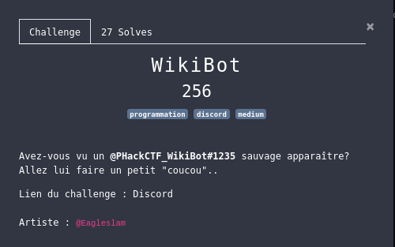

# WikiBot

## Description



## Solve

Nous avons un lien vers le discord du CTF.

Après avoir envoyer un DM au bot, celui-ci, nous demande de répondre à une série de questions en moins de 3 secondes.

Pour résoudre ce challenge, je vais utilisé mon compte Discord pour communiquer avec ce bot à travers l'API discord.

J'ai donc besoin de [DiscordPy](https://discordpy.readthedocs.io/en/latest/index.html) pour mon programme en python.

J'ai besoin de deux informations, pour pouvoir communiquer avec le bot.

```python
BOT_TOKEN = "<TOKEN>" # Le token ID  de mon profil discord
TARGET_ID = <AUTHOR_ID> # Le message.author.id cible du bot du challenge
```

Au final, j'ai écrit le code suivant [bot_discord.py](bot_discord.py) :

```python
class MyClient(discord.Client):
    async def on_ready(self):
        print('Logged on as {0}!'.format(self.user))

    async def on_message(self, message):
        if(message.author.id == TARGET_ID):
            if("Wanna play with me ?" in message.content):
                await message.channel.send("yes")
            elif("Is that okay ?" in message.content):
                await message.channel.send("yes")
            elif("Daniel Ricciardo" in message.content):
                await message.channel.send("Perth")
            elif("Barack Obama" in message.content):
                await message.channel.send("08/04/1961")
            elif("Gal Gadot" in message.content):
                await message.channel.send("Israeli")
            elif("Omar Sy" in message.content):
                await message.channel.send("43")
            elif("Billie Eilish" in message.content):
                await message.channel.send("Billie Eilish Pirate Baird O'Connell")
            elif("best CTF" in message.content):
                await message.channel.send("P'HackCTF")

client = MyClient()
client.run(BOT_TOKEN, bot=False) # bot=False, because it's my real user token account (not a dev bot_token from discord)
```

Après éxecution de celui-ci:
```shell
python3 bot_discord.py
```

J'obtiens le flag en DM.

## Flag

**PHACK{i_4m_th3_w1k1_b0t}**
