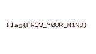

# Leap of Faith

## Description


## Résolution

D'apres la description, il s'agit d'une citation du film matrix, avec comme particularité de nous parler d'outils de stego, avec une [image de neo](src/leap_of_faith.jpg).

La première chose que je fais, c'est une verification du type de fichier :
```bash
file leap_of_faith.jpg
```


Rien d'anormale dans le fichier, il correspond bien à son type.

J'essaye donc d'extraire les données exif de l'image.
```bash
exiftool leap_of_faith.jpg
```


Je remarque la présence d'un thumbnail, que j'extrais de la manière suivante:
```bash
exiftool -b -ThumbnailImage leap_of_faith.jpg > thumb1.jpg
```
J'obtiens une image de Morpheus.


Je répète l'opération précédente
```bash
exiftool thumb1.jpg
```


```bash
exiftool -b -ThumbnailImage thumb1.jpg > thumb2.jpg
```
Nous obtenons le flag, sous forme de fichier jpg.



## Flag

**flag{FR33_Y0UR_M1ND}**

