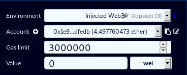
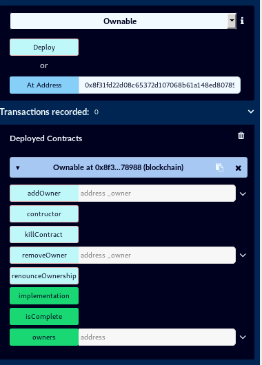

# Multi_Contract_Owner

## Description


## Résolution

### Mise en place de l'environnement de travail

1. Pre-requis :

	* Apprentissage du langage solidity : [CryptoZombie](https://cryptozombies.io/)
	* Quelques bases en Javascript.

2. Installation du plugin [Metasmask](https://metamask.io/) :
	
	Celui-ci va nous servir de Wallet pour nos transactions avec la blockchain de test.
	
	Paramétrer le wallet sur le ``Ropsen Test Network``, puis deposer de ``l'ether Faucet`` pour nos futures transactions.

	

	Voilà notre plugin metasmask est prêt.

3. Paramétrage de l'IDE [Remix](https://remix.ethereum.org/)

	``Remix`` est un IDE du langage ``solidity`` qui va nous permettre d'interagire avec les contrats deployés dans la blockchain.

	Le choix de la version du compilateur doit être le même que celui de notre code (valeur à côté du pragma).
	
	Maintenant dans la section run de ``Remix``:

	

	Si la case Account est vide, il s'agit d'un bug connu, dans la console du navigateur entrez la commande suivante:
	```console
	window.ethereum.enable()
	```

### Le challenge


Nous avons le contrat suivant à deployer dans la blockchain :
```solidity
pragma solidity ^0.4.24;

contract Ownable {

    event OwnerAdded(address);
    event OwnerRemoved(address);

    address public implementation;
    mapping (address => bool) public owners;

    modifier onlyOwner() {
        require(owners[msg.sender], "Must be an owner to call this function");
        _;
    }

    /** Only called when contract is instantiated
     */
    function contructor() public payable {
        require(msg.value == 0.5 ether, "Must send 0.5 Ether");
        owners[msg.sender] = true;
    }

    /** Add an owner to the owners list
     *  Only allow owners to add other owners
     */
    function addOwner(address _owner) public onlyOwner { 
        owners[_owner] = true;
        emit OwnerAdded(_owner);
    }

    /** Remove another owner
     *  Only allow owners to remove other owners
     */
    function removeOwner(address _owner) public onlyOwner { 
        owners[_owner] = false;
        emit OwnerRemoved(_owner);
    }

    /** Remove all owners mapping and relinquish control of contract
     */
    function renounceOwnership() public {
        assembly {
            sstore(owners_offset, 0x0)
        }
    }
    
    /** CTF helper function
     *  Used to clean up contract and return funds
     */
    function killContract() public onlyOwner {
        selfdestruct(msg.sender);
    }

    /** CTF helper function
     *  Used to check if challenge is complete
     */
    function isComplete() public view returns(bool) {
        return owners[msg.sender];
    }

}
```
Nous déployons le contrat en appuyant sur ``deploy``, puis nous entrons son adresse dans Remix:




Le but des challenges de ce ctf, est que la fonction isComplete renvoie True.

Ici le but va être d'être le ``Owner`` de ce contrat.

Ainsi, en lisant le code nous remarquons qu'un appel à la fonction ``contructor`` avec l'envoi de ``0.5 ether`` (Apppuyez sur ``constructor`` en ayant mis ``0.5 ether`` dans le champs ``Value`` sur ``Remix``).
Alors nous sommes donc maintenant dans la table des ``owners``, la condition ``isComplete()`` est vérifié.


Ce challenge est simple car il servait d'introduction aux autres challenges du CTF.

## Flag

**flag{3v3ryb0dy5_hum4n_r34d_c10s31y}**

