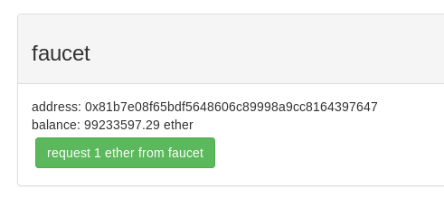
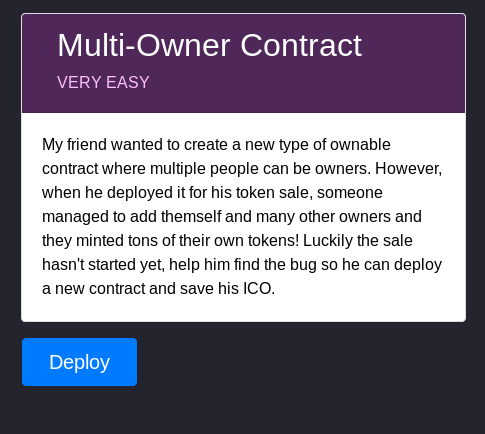
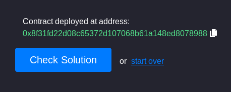
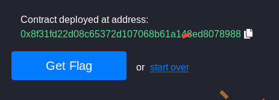
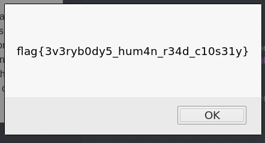

# Multi_Contract_Owner

## Description


## Résolution

### Mise en place de l'environnement de travail

1. Pre-requis :

	* Apprentissage du langage solidity : [CryptoZombie](https://cryptozombies.io/)
	* Quelques bases en Javascript

2. Installation du plugin [Metasmask](https://metamask.io/) :
	
Celui ci va nous servir de Wallet pour nos transactions.
Parametrer le wallet sur le Ropsen Test Network, puis deposer de l'ether Faucet pour nos transaction.



Voila notre plugin metasmask est pret.

3. Parametrage de l'IDE [Remix](https://remix.ethereum.org/)

Remix est un IDE du langage solidity qui va nous permettre d'interagire avec les contrats deployer dans la blockchain.
Le choix du compilateur doit etre le meme ecrit dans le code a cote de pragma.
Maintenant dans la section run :


Si la case account est vide, alors dans la console du navigateur ajouter la commande suivante
```console
window.ethereum.enable()
```

### Le challenge



Nous avons le contrat suivant a deployer sur la blockchain :
```solidity
pragma solidity ^0.4.24;

contract Ownable {

    event OwnerAdded(address);
    event OwnerRemoved(address);

    address public implementation;
    mapping (address => bool) public owners;

    modifier onlyOwner() {
        require(owners[msg.sender], "Must be an owner to call this function");
        _;
    }

    /** Only called when contract is instantiated
     */
    function contructor() public payable {
        require(msg.value == 0.5 ether, "Must send 0.5 Ether");
        owners[msg.sender] = true;
    }

    /** Add an owner to the owners list
     *  Only allow owners to add other owners
     */
    function addOwner(address _owner) public onlyOwner { 
        owners[_owner] = true;
        emit OwnerAdded(_owner);
    }

    /** Remove another owner
     *  Only allow owners to remove other owners
     */
    function removeOwner(address _owner) public onlyOwner { 
        owners[_owner] = false;
        emit OwnerRemoved(_owner);
    }

    /** Remove all owners mapping and relinquish control of contract
     */
    function renounceOwnership() public {
        assembly {
            sstore(owners_offset, 0x0)
        }
    }
    
    /** CTF helper function
     *  Used to clean up contract and return funds
     */
    function killContract() public onlyOwner {
        selfdestruct(msg.sender);
    }

    /** CTF helper function
     *  Used to check if challenge is complete
     */
    function isComplete() public view returns(bool) {
        return owners[msg.sender];
    }

}
```
Nous deployons le contrat puis entrons son addresse dans Remix:



Nous entrons l'addresse de notre contrat dans Remix :


Le but est que notre fonction isComplete renvoie True.
En lisant le code nous remarquons qu'un appel a la fonction contructeur avec un cout de 0.5 ether, nous permet de verifier la condition isComplete().





Challenge tres simple qui servait juste d'introduction aux autres challenges.

## Flag

**flag{3v3ryb0dy5_hum4n_r34d_c10s31y}**

