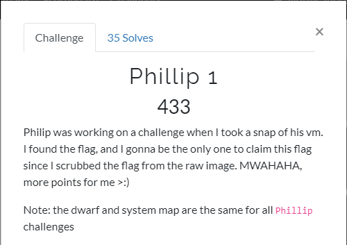

# Phillip 1

## Description



We have 3 files in this challenge:
* module.dwarf
* philip-1.raw.zip
* System.map-5.8.0-25-generic

## Solve

We quickly understand, we have `dwarf` and `System.map` for built a custom volatility profile, for analysing our philip-1.raw .

So let's build it:
```shell
$ zip _phillip.zip module.dwarf System.map-5.8.0-25-generic
$ sudo mv _phillip.zip /usr/local/lib/python2.7/dist-packages/volatility/plugins/overlays/linux/.
$ sudo vol.py --info | grep phillip
Volatility Foundation Volatility Framework 2.6.1
Linux_phillipx64              - A Profile for Linux _phillip x64
```

Ok,now we have the profile, we can dig into our dump.

In first, I check the bash_history :
```shell
$ sudo vol.py -f philip-1.raw --profile=Linux_phillipx64 linux_bash
Volatility Foundation Volatility Framework 2.6.1
Pid      Name                 Command Time                   Command
-------- -------------------- ------------------------------ -------
    1534 bash                 2021-04-03 03:18:46 UTC+0000   clear
    1534 bash                 2021-04-03 03:19:19 UTC+0000   scp -i key -P 5001 ./super-secret-flag lubuntu@chals2.umdctf.io:~/
    1534 bash                 2021-04-14 22:11:37 UTC+0000   ssh -i key lubuntu@chals2.umdctf.io -p 5001

```

Ok, we had many information here:
* First, he sends `super-secret-flag` to lubuntu@chals2.umdctf.io through ssh with his private key.
* Secondly, he connects to this ssh with his private key.

We need to find his private key:
```shell
$ sudo vol.py -f philip-1.raw --profile=Linux_phillipx64 linux_enumerate_files | grep /home/lubuntu
...
0xffff95f1c3139f60                      5702 /cow/upper/home/lubuntu/key
0xffff95f1c313d7a0                      5697 /cow/upper/home/lubuntu/super-secret-flags
...
```

We are dumping these files:
```shell
$ sudo vol.py -f philip-1.raw --profile=Linux_phillipx64 linux_find_file -i 0xffff95f1c3139f60 -O key
$ sudo vol.py -f philip-1.raw --profile=Linux_phillipx64 linux_find_file -i 0xffff95f1c313d7a0 -O super-secret-flags
```

Firstly, we check `super-secret-flags`:
```shell
$ cat super-secret-flags  | base64 -d
{i_can_patch_ez_try_again}
```

A dead end, but we have also a private ssh key:
```shell
$  ssh -i key lubuntu@chals2.umdctf.io -p 5001
Welcome to Ubuntu 20.04.2 LTS (GNU/Linux 5.4.0-51-generic x86_64)

 * Documentation:  https://help.ubuntu.com
 * Management:     https://landscape.canonical.com
 * Support:        https://ubuntu.com/advantage

This system has been minimized by removing packages and content that are
not required on a system that users do not log into.

To restore this content, you can run the 'unminimize' command.

The programs included with the Ubuntu system are free software;
the exact distribution terms for each program are described in the
individual files in /usr/share/doc/*/copyright.

Ubuntu comes with ABSOLUTELY NO WARRANTY, to the extent permitted by
applicable law.

$ ls
super-secret-flag
$ cat super-secret-flag | base64 -d
UMDCTF-{G4ll4gh3r_4_1if3}
```

Et voilà, we found the flag !

## Flag

**UMDCTF-{G4ll4gh3r_4_1if3}**
