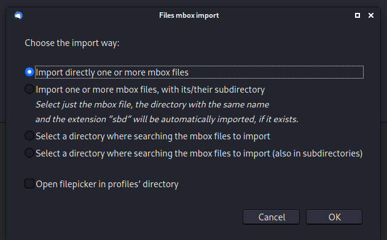

# Phillip 2

## Description


We have 3 files in this challenge:
* module.dwarf
* philip-2.raw.zip
* System.map-5.8.0-25-generic

The `module.dwarf` and `System.map` are the same than `phillip 1`, so I re-use the profile.

## Solve

Fristly, we are checking the bash history:
```shell
$ sudo vol.py -f philip-2.raw --profile=Linux_phillipx64 linux_bash
NOTHING_FOUND
```

Ok, lets try to found and dump `.bash_history`:
```shell
$ sudo vol.py -f philip-2.raw --profile=Linux_phillipx64 linux_enumerate_files | grep /home/lubuntu/.bash_history
Volatility Foundation Volatility Framework 2.6.1
0xffff95f1c623fc30                      5690 /cow/upper/home/lubuntu/.bash_history
$ sudo vol.py -f philip-2.raw --profile=Linux_phillipx64 linux_find_file -i 0xffff95f1c623fc30 -O bash_history
```

Lets check this history:
```shell
$ cat bash_history                   
sudo apt update
sudo apt install thunderbird
clear
exit
```

It's just an `thunderbird` an email client installation, we trying to found all `thunderbird` files:
```shell
$ sudo vol.py -f philip-2.raw --profile=Linux_phillipx64 linux_enumerate_files | grep /home/lubuntu/.sthunderbird
Volatility Foundation Volatility Framework 2.6.1
Volatility Foundation Volatility Framework 2.6.1
WARNING : volatility.debug    : Overlay structure cpuinfo_x86 not present in vtypes
WARNING : volatility.debug    : Overlay structure cpuinfo_x86 not present in vtypes
...
0xffff95f1f02473c0                      6114 /cow/upper/home/lubuntu/.thunderbird/hlza10kp.default-release/ImapMail/imap.gmail.com/INBOX
0xffff95f1f0246e20                      6099 /cow/upper/home/lubuntu/.thunderbird/hlza10kp.default-release/ImapMail/imap.gmail.com/INBOX.msf
0xffff95f1f0244120                      6115 /cow/upper/home/lubuntu/.thunderbird/hlza10kp.default-release/ImapMail/imap.gmail.com/[Gmail].sbd
0xffff95f1f0242aa0                      6122 /cow/upper/home/lubuntu/.thunderbird/hlza10kp.default-release/ImapMail/imap.gmail.com/[Gmail].sbd/Trash.msf
0xffff95f1c32099c0                      6120 /cow/upper/home/lubuntu/.thunderbird/hlza10kp.default-release/ImapMail/imap.gmail.com/[Gmail].sbd/Spam.msf
0xffff95f1c320f3c0                      6012 /cow/upper/home/lubuntu/.thunderbird/hlza10kp.default-release/ImapMail/imap.gmail.com/[Gmail].sbd/Drafts.msf
0xffff95f1f02408e0                      6121 /cow/upper/home/lubuntu/.thunderbird/hlza10kp.default-release/ImapMail/imap.gmail.com/[Gmail].sbd/Starred.msf
0xffff95f1f0240340                      6119 /cow/upper/home/lubuntu/.thunderbird/hlza10kp.default-release/ImapMail/imap.gmail.com/[Gmail].sbd/Sent Mail.msf
0xffff95f1f0242500                      6118 /cow/upper/home/lubuntu/.thunderbird/hlza10kp.default-release/ImapMail/imap.gmail.com/[Gmail].sbd/Important.msf
0xffff95f1f02435e0                      6116 /cow/upper/home/lubuntu/.thunderbird/hlza10kp.default-release/ImapMail/imap.gmail.com/[Gmail].sbd/All Mail.msf
0xffff95f1f0244c60                      6113 /cow/upper/home/lubuntu/.thunderbird/hlza10kp.default-release/ImapMail/imap.gmail.com/[Gmail].msf
0xffff95f1f0246b50                      6100 /cow/upper/home/lubuntu/.thunderbird/hlza10kp.default-release/ImapMail/imap.gmail.com/Archives.msf
0xffff95f1f0247c30                      6112 /cow/upper/home/lubuntu/.thunderbird/hlza10kp.default-release/ImapMail/imap.gmail.com/msgFilterRules.dat
0xffff95f1f0247960                      6110 /cow/upper/home/lubuntu/.thunderbird/hlza10kp.default-release/ImapMail/imap.gmail.com/Sent.msf
0xffff95f1c623e5b0                      6109 /cow/upper/home/lubuntu/.thunderbird/hlza10kp.default-release/ImapMail/imap.gmail.com/Templates.msf
0xffff95f1c5429150                      6108 /cow/upper/home/lubuntu/.thunderbird/hlza10kp.default-release/ImapMail/imap.gmail.com/Drafts.msf
0xffff95f1c320f0f0                      6087 /cow/upper/home/lubuntu/.thunderbird/hlza10kp.default-release/ImapMail/imap.gmail.com.msf
...
```

They are many files, but only two very interesting: `INBOX` and `INBOX.msf`.

You can find more info about `.msf` [here](https://www.bitrecover.com/free/thunderbird-msf-viewer/).

With these two files, we can import this INBOX dump into our `thunderbird client`.
```
$ mkdir local
$ sudo vol.py -f philip-2.raw --profile=Linux_phillipx64 linux_find_file -i 0xffff95f1f02473c0 -O local/INBOX
$ sudo vol.py -f philip-2.raw --profile=Linux_phillipx64 linux_find_file -i 0xffff95f1f0246e20 -O local/INBOX.msf
```

* A little tutorial for import:


* You need to select the INBOX file.


* We found 5 email, but only two interesting.


* We have a `Invoice.zip` and a `password` 


* We unzip `invoice.zip` with the password


Et voilà, we found the flag !

## Flag

**UMDCTF-{M3g4_Ch4#g4$}** 

:trollface:

