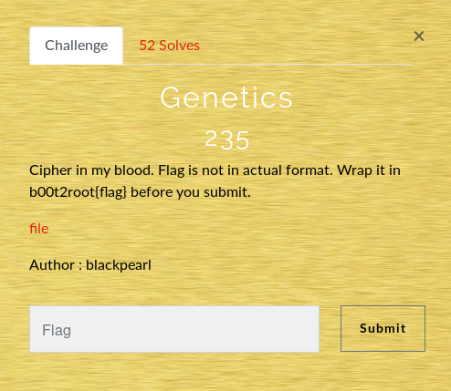

# Scatter-me

## Description



## Résolution

J'ouvre mon [fichier](Bibliography.txt).

```bash
ACCAGTAAAACGTTGAGACAGTTGAATATCAAACTACACCGAATTCATATGTCACAGCGGCCGACACAGATGATAACA
```

Le première chose que je remarque, c'est la présence de seulement 4 lettres différentes dans notre code : [su]A[/su], [su]C[/su], [su]T[/su] et [su]G[/su].

Je lance un recherche sur google, aussitôt je tombe sur des sites qui parle de codage génétique (qui d'ailleurs est le titre du chall).

J'essaye les différents sites pour déchiffrer le code (celui sur decode.fr par exemple), sans succès.
Puis je tombe sur une présentation d'un langage ésotérique grâce au code génétique : [DNA encoding protocol](https://www.slideshare.net/amitsnyderman/dna-encoding-protocol)

Ceci est une fausse piste, car il s'git d'un encodage pour base 64, donc je cherche une autre source, pour enfin tomber sur le github de JohnHammond "ctf-katana" avec la table suivante:
 


J'écrit un [programme python](DNAdecoder.py) ainsi qu'un petit script bash pour son exécution :

```bash
#!/bin/bash

if [ $# != "1" ]
then
    echo -e "filename not found!"
    echo -e "usage: $0 <filename>"
else
    python3 DNAdecoder.py $1
    cat flag.txt
    rm flag.txt
fi
```


Et voilà, nous obtenons le flag.

```bash
./DNAdecoder.sh Bibliography.txt
flag is dnaCrypto1sAwesomcat
```
## Flag

[su]b00t2root{dnaCrypto1sAwesomcat}[/su]
