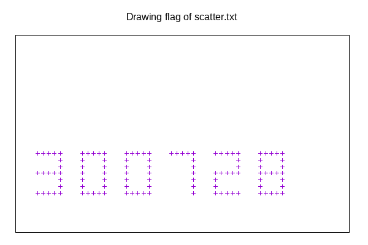

# Scatter-me

## Description


## Résolution

J'ouvre mon [fichier](scatter.txt).

```bash
1:3:1;1.25:3:1;1.5:3:1;1.75:3:1;2:3:1;2:2.75:1;2:2.5:1;2:2.25:1;2:2:1;2:1.75:1;2:1.5:1;1:2.25:1;1.25:2.25:1;1.5:2.25:1;1.75:2.25:1;1:1.5:1;1.25:1.5:1;1.5:1.5:1;1.75:1.5:1;3:3:1;3.25:3:1;3.5:3:1;3.75:3:1;4:3:1;4:2.75:1;4:2.5:1;4:2.25:1;4:2:1;4:1.75:1;4:1.5:1;3:1.5:1;3.25:1.5:1;3.5:1.5:1;3.75:1.5:1;3:1.75:1;3:2:1;3:2.25:1;3:2.5:1;3:2.75:1;5:3:1;5.25:3:1;5.5:3:1;5.75:3:1;6:3:1;6:2.75:1;6:2.5:1;6:2.25:1;6:2:1;6:1.75:1;6:1.5:1;5.75:1.5:1;5.5:1.5:1;5.25:1.5:1;5:1.5:1;5:1.75:1;5:2:1;5:2.25:1;5:2.5:1;5:2.75:1;7:3:1;7.25:3:1;7.5:3:1;7.75:3:1;8:3:1;8:2.75:1;8:2.5:1;8:2.25:1;8:2:1;8:1.75:1;8:1.5:1;9:3:1;9.25:3:1;9.5:3:1;9.75:3:1;10:3:1;10:2.75:1;10:2.5:1;10:2.25:1;9.75:2.25:1;9.5:2.25:1;9.25:2.25:1;9:2.25:1;9:2:1;9:1.75:1;9:1.5:1;9.25:1.5:1;9.5:1.5:1;9.75:1.5:1;10:1.5:1;11:3:1;11.25:3:1;11.5:3:1;11.75:3:1;12:3:1;12:2.75:1;12:2.5:1;12:2.25:1;12:2:1;12:1.75:1;12:1.5:1;11.75:1.5:1;11.5:1.5:1;11.25:1.5:1;11:1.5:1;11:1.75:1;11:2:1;11:2.25:1;11:2.5:1;11:2.75:1;11.25:2.25:1;11.5:2.25:1;11.75:2.25:1
```

Je remarque que ce sont des cordonnées contenant les axes x, y et z(=1 donc inutile), et délimité par les caractères *:* et *;*.

Je vais utiliser *gnuplot* pour l'affichage, je formate donc mon fichier grâce à *sed*, puis je l'affiche dans *gnuplot* grâce à mon [script bash](scatter-me.sh). 

```bash
#!/bin/bash

if [ $# != "1" ]
then
    echo -e "usage: $0 <filename>\nNeed a filename!"
else
    cp $1 data.tmp
    filename=data.tmp
    
    # Formatage du fichier pour gnuplot
    sed -i "s/;/\n/g" $filename
    cut -d:  -f1-2 < $filename > tmp
    cp tmp $filename
    sed -i "s/:/ /g" $filename

    # Affichage avec gnuplot
    echo "set terminal png size 600,400 enhanced background rgb 'white'" > gnu_script
    echo "set output 'flag.png'" >> gnu_script
    echo "set title 'Drawing flag of $1" >> gnu_script
    echo "set xr [0:15]" >> gnu_script
    echo "set yr [0:7.5]" >> gnu_script
    echo "unset xtics" >> gnu_script
    echo "unset ytics" >> gnu_script
    echo "set nokey" >> gnu_script
    echo "plot '$filename' with points" >> gnu_script

    gnuplot gnu_script
    
    # Suppresion des fichiers temporaire
    rm gnu_script tmp data.tmp
    
    # Affichage du flag
    display flag.png&
fi
```
Et voilà nous obtenons le passcode.



## Flag

**b00t2root{300728}**
